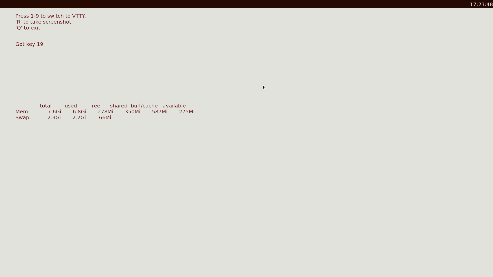

# drm-shell

A toy graphical shell running directly on top of Linux's DRM subsystem written in modern Java (22, early access)
using Foreign Function & Memory API. 

The project includes high-level wrappers for libdrm, libinput and libseat and it has a basic poll loop for listening to events. 
It uses double-buffering with vsync and renders via Skija (https://github.com/HumbleUI/Skija/). The program also features
a very basic GUI toolkit that handles damages/redraws.

## Installation

The project uses bleeding-edge versions of both the JDK and jextract, so packaging it is very hard, only Nix is supported.
As of now it only supports "manual building" inside a nix shell.

In order to do that check out the project and issue `nix develop`. Note that it will take quite some time the first time, as it will
have to build the JDK, which takes something on the order of 10 minutes. After you are inside the shell, 
simply issue the following:

```shell
nix develop
gradle installDist
```

## Running

By default, the program will use the video card `/dev/dri/card0`, to change that (e.g. if you have multiple cards) 
add the desired path as a command line argument. Go to an unused tty and issue the following

```shell
./shell.sh

# Using card1 instead
./shell.sh /dev/dri/card1
```

## Screenshots

